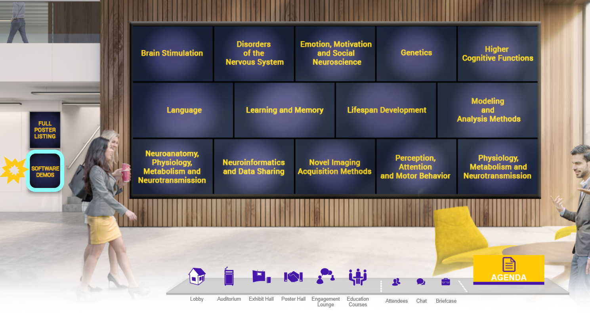

# <a href="https://github.com/compneuro-da/rsHRF/tree/update">The rsHRF toolbox (v2.2): Additional features and analyses, and extended user documentation</a>
Presented at the OHBM 2020 annual meeting (virtual poster #1929)

## :triangular_flag_on_post: Where to Find My Poster and Me?

* You can find my POSTER at the Software Demos (indicated by the :star2:yellow star:star2: on the image below)! 

* Do you want to chat & discuss? :speech_balloon:  
  - Slots pre-scheduled by OHBM: 
      *Note*: I won't be available for slot 2 and 3 as these are in the middle of the night for me (CEST).
    - **Slot 1: Wednesday, June 24**: 13.00H - New York | 18.00 - London | 1.00H + 1d - Hong Kong
    - **Slot 2: Friday, June 26**: 21.00H - New York | 2.00 + 1d - London | 9.00H + 1d - Hong Kong --> I won't be available. 
    - **Slot 3: Tuesday, June 30**: 21.00H - New York | 2.00 + 1d - London | 9.00H + 1d - Hong Kong --> I won't be available. 
    - **Slot 4: Thursday, July 3**: 3.00H - New York | 8.00 - London | 12.00H - Hong Kong

  - Ping me on Twitter or Mattermost (@sofie_vdbos or <a href="https://mattermost.brainhack.org/brainhack/channels/hbm-rshrf_toolbox">hbm-rsHRF_toolbox</a>)! 
  
  - Leave a "post-it" in the <a href="https://docs.google.com/document/d/1_FxovLEp4nj52ahuAvveOl0oHwtEPC4Yu_kRx-Bpx-Q/edit?usp=sharing">Google Doc</a>! :incoming_envelope:
    

